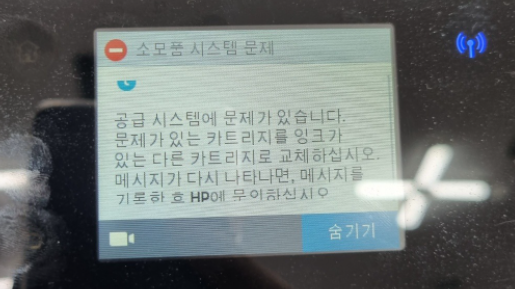
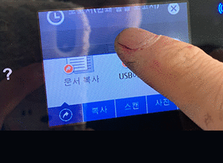

# AS 블로그 사용가이드

## 1. 오류메시지 떠있어 출력자체가 불가한경우.

* 위와같이 프린터에 오류메시지가 떠있으면 '증상별 자가 AS 방법' 으로 이동하여 조치해주세요.



## 2. 인쇄품질이 불량한 경우

* 인쇄품질 보고서를 출력해주세요.
* **7110 사용자** 인쇄품질보고서 출력 방법은 아래 링크.



* 위와같이 **'인쇄품질보고서'의 품질**이 불량한 경우 아래 링크로 들어가서 참고해주세요.



## 3. 인쇄품질 보고서는 출력이 되지만 컴퓨터에서 프린트하면 안나오는 경우

* 인쇄품질보고서는 일단 출력해보신 다음 출력물 상태가 불량하다면 2번 '인쇄품질이 불량한 경우' 를 참고해주세요.
* 인쇄품질보고서는 제대로 나오지만 컴퓨터에서 프린트하면 안나오는 경우 아래의 링크로 들어가 조치해주세요.



