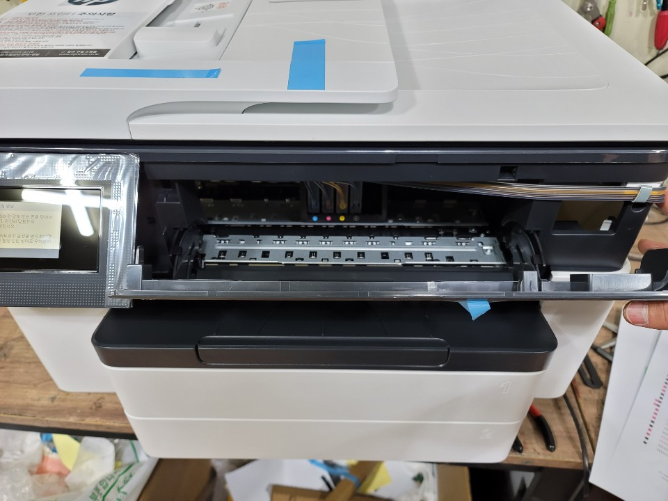

# 카트리지 문제 발생시

카트리지 문제 발생시 자신의 프린터가 무칩기기인지 칩기기 인지 먼저 확인해주셔야합니다.



### 무칩기기 해결방법

무칩기기는 앞 덮개를 열고 헤드가 가운데로 오면 다시 닫는 것을   
3~5회 정도 해주시면 자동으로 초기화되며 메시지가 사라집니다.

### 칩기기 해결방법



칩기기는 영상과 같이 카트리지 재장착 방법을 해보시고 만약 해결이 안되시면  
펌웨어 버전을 확인해주셔야합니다.

펌웨어버전은 가운데의 숫자 4자리입니다. \( 예: 1817, 1927, 2024 등등 \)  
숫자의 앞 두자리는 '년도'이고 뒷 두자리는 '몇주인지' 입니다.  
ex\) 1817 이면 18년도 17주차에 이뤄진 펌웨어입니다.

  
만약 펌웨어버전이 21로시작하면 21년도 최신업데이트가 진행된것 입니다.  
이 경우에는 무칩메인보드로 개조해야합니다.



### 

#### 만약 업데이트가 안되었다면

이때는 두가지 방법이 있습니다.  
1. 해당 카트리지칩만 교체하는 방법 \*권장하지 않는 방법입니다.\*  
\( 검정색이 떴으면 검정색만 구입해서 교체 \)  
하지만 추후 동일문제 뜰수있으며 비용은 칩 하나에 2만원입니다.   
[칩 구입링크.](http://www.hprinter.co.kr/product/hp-8210-8710-7720-7740-%EA%B0%9C%EB%B3%84-%EB%AC%B4%ED%95%9C-%ED%86%B5%ED%95%A9%EC%B9%A9/782/category/59/display/1/) 클



2. 무칩으로 개조하기  
추후에 동일문제가 발생하지 않는 무칩개조가 낫습니다.



