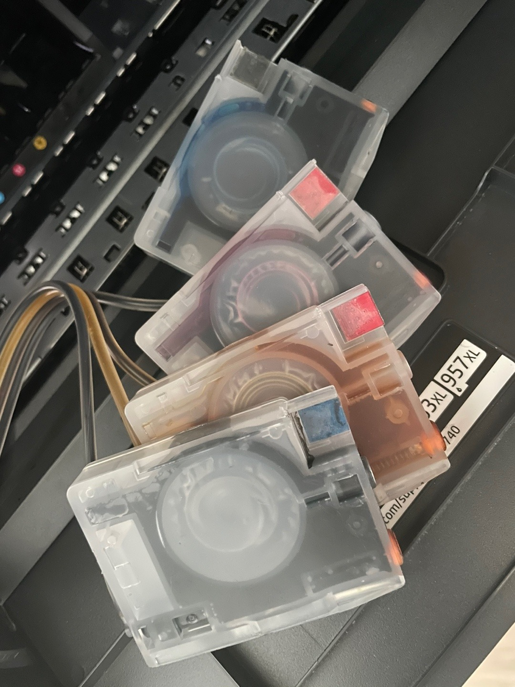

# 소모품시스템문제

소모품시스템 문제 발생시에는 **자신의 프린터가 무칩기기 인지 칩기기 인지 확인하는것이 중요**합니다.



펌웨어 버전에 NON이나 NC 라고 적혀있으면 '무칩기기'입니다. 그 외에는 '칩기기'입니다.  
기기를 확인하였다면 아래를 참고하여 조치해주세요.

### '무칩기기' 소모품 시스템문제 해결방법.



### 

### '칩기기' 소모품 시스템문제 해결방법



### 초기화 이후에도 동일하게 '소모품 시스템문제' 가 뜬다면? \( 칩기기 해당 \)



* 위 영상을 통해 공장초기화를 해주세요.

### 그래도 소모품시스템문제가 계속 뜹니다.

이 경우에는 두가지를 확인해주셔야합니다.

  
**1. 잉크통에 잉크가 있는지 확인해주세요.**  
무한잉크는 정품이 아니기 때문에 프린터화면에 떠있는 잉크잔량과는 상관없습니다. 꼭 잉크통에서 직접 잉크가 있는지 없는지를 확인해주세요.    



**2. 카트리지에 잉크가 차있는지 확인해주세요.**

