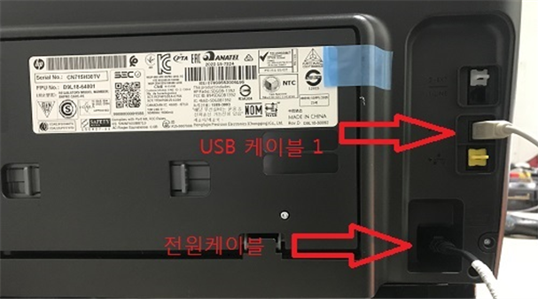
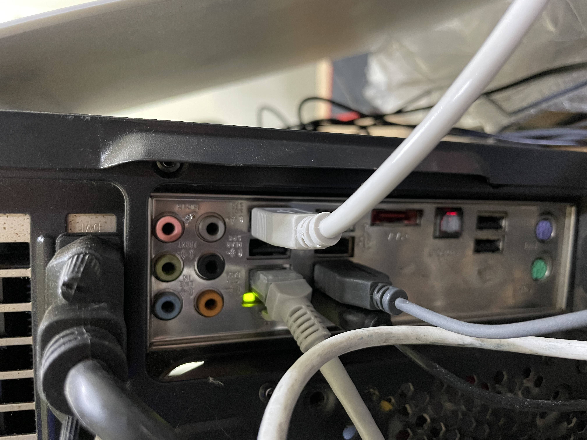

# USB로 연결하신분

* 프린터 뒷면에 USB선과 컴퓨터쪽에 꽂힌 USB선을 뺐다가 5초간 기다리고 다시 꽂아주세요. 이 때 컴퓨터쪽의 USB단자는 기존에 꽂았던 단자와 다른위치에 꽂아주세요.
* 이후에도 안되시는 분은 드라이버 재설치 해주세요. \( 아래 클릭 \)



* 만약 위 방법대로 했는데 인식을 못하는경우 컴퓨터쪽 단자나 USB케이블의 문제일 수 있습니다.

