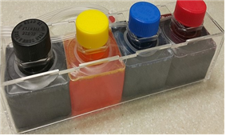

# 잉크통별 잉크 잔량 확인 방법

## 마이공급기 잔량 확인방법.

마이공급기는 육안으로 확인해주셔야하며 안에 잉크가 없지만 겉에묻어있는것일 수 도 있으니 **꼭 '뚜껑'을 열어서 확인**하시고 **절반 정도** 남아있는지 확인해주세요.

* 잉크구입링크는 **아래 클릭.**

{% embed url="http://www.hprinter.co.kr/product/%EB%AC%B4%ED%95%9C%EC%9E%89%ED%81%AC-%EB%A6%AC%ED%95%84-%EB%A7%88%EC%9D%B4%EB%A7%A5%EC%8A%A4%EA%B3%B5%EA%B8%89%EA%B8%B0%EC%9A%A9/622/category/40/display/1/" %}

## 엑스공급기 잔량 확인방법.

* 엑스공급기의 경우 일단 잉크통에 전원이 연결되어있는지 확인해주세요. \( 공급기의 전원은 잉크잔량 확인용 \) 위 사진과 같이 왼쪽의 버튼이나 공급기에 불빛이 안들어오면 전원연결이 안되어있는것입니다.
* 전원을 연결하고 10분가량 기다리면 잉크가 없는 색상에 깜빡이며 경고음이 날것입니다.

* 잉크구입링크는 **아래 클릭.**

{% embed url="http://www.hprinter.co.kr/product/%EB%AC%B4%ED%95%9C%EC%9E%89%ED%81%AC-%ED%8C%A9/789/category/40/display/1/" %}

## 맥스공급기 잔량 확인방법.

* 맥스공급기는 '검정색'에만 센서가 존재합니다. 경고음이 울린다면 나머지 색상들도 서랍을 열어서 확인해주세요.

* 센서가 작동하지 않을 경우 서랍 이탈방지 클립을 해제하고 위 사진과 같이 잉크서랍을 열어서 손으로 누르면서 출렁이는지 바닥이 만져지는지 확인해주세요.

* 잉크구입링크는 **아래 클릭**

{% embed url="http://www.hprinter.co.kr/product/%EB%AC%B4%ED%95%9C%EC%9E%89%ED%81%AC-%EB%A6%AC%ED%95%84-%EB%A7%88%EC%9D%B4%EB%A7%A5%EC%8A%A4%EA%B3%B5%EA%B8%89%EA%B8%B0%EC%9A%A9/622/category/40/display/1/" %}

